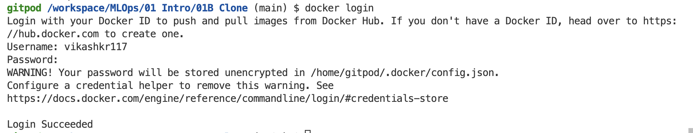
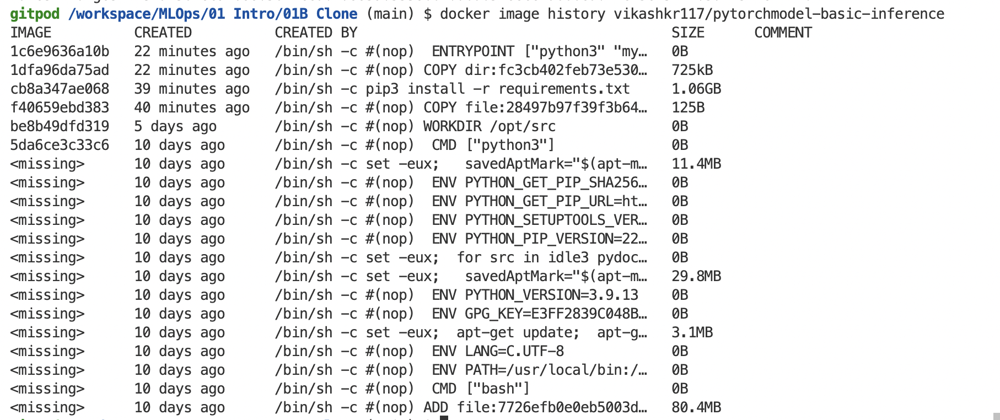
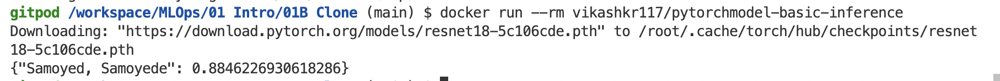
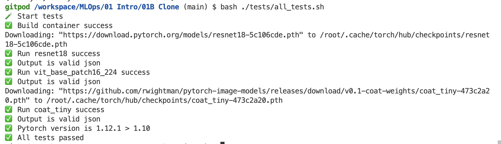
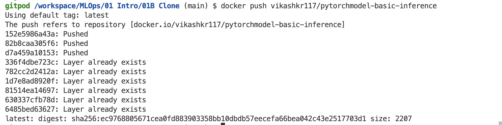
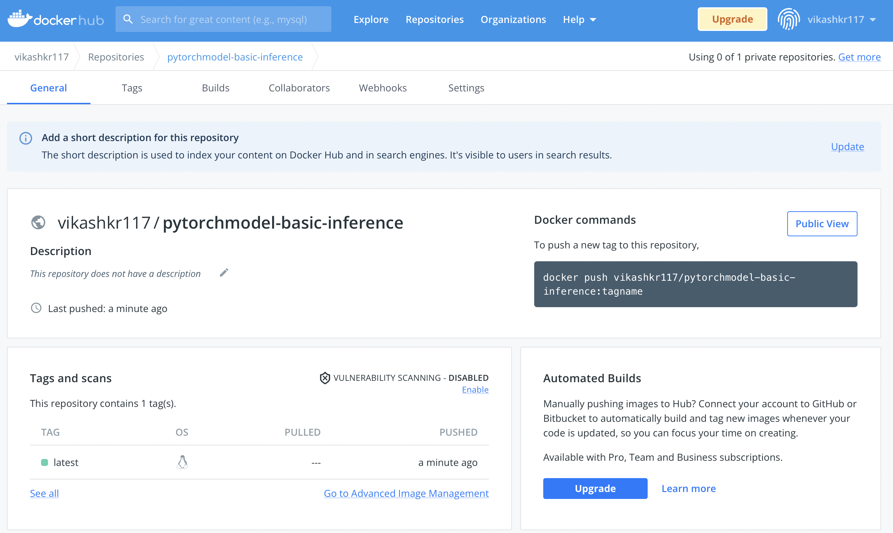

# Docker

## 💡Use Gitpod, Codespace, Server or Local machine with Docker installed
First create an account buddy

## 💡💡Link account in Docker Hub

To push to [Docker hub](https://hub.docker.com) repository ( to be usd by other teams/ people - public or private )

Sign in to docker hub with your account (say username is : vikashkr117)

Create a access token and save the password (say access from gitpod IDE )

When logging in from your Docker CLI client (say, Gitpod), use this token as a password.

To login to Docker Hub
```
docker login
```


## How to run ?

Clone this repo using `Play with Docker` or `Gitpod` etc or in local with docker installed 

Build a docker file
```
docker build --tag vikashkr117/pytorchmodel-basic-inference .
```

### Who is 🐘 here 
```
docker image history vikashkr117/pytorchmodel-basic-inference
```


To run docker (here using default params db.IMAGE & db.MODEL)
```
docker run --rm vikashkr117/pytorchmodel-basic-inference
```


To run docker (custom 🐈 image link)
```
docker run --rm vikashkr117/pytorchmodel-basic-inference db.IMAGE=https://pbs.twimg.com/profile_images/664169149002874880/z1fmxo00_400x400.jpg
```


To run test cases
```
bash ./tests/all_tests.sh
```



To push to docker hub
```
docker push vikashkr117/pytorchmodel-basic-inference
```





To remove any dangling builds/images, stopped containers
```
docker system prune
```


## Appendix

### Libraries to try 
1. [Facebook's Hydra](https://hydra.cc/docs/intro/) [Github](https://github.com/facebookresearch/hydra)
2. https://github.com/pallets/click
3. https://github.com/tiangolo/typer

### Disable terminal text outputs
1. Use **logging library** 
