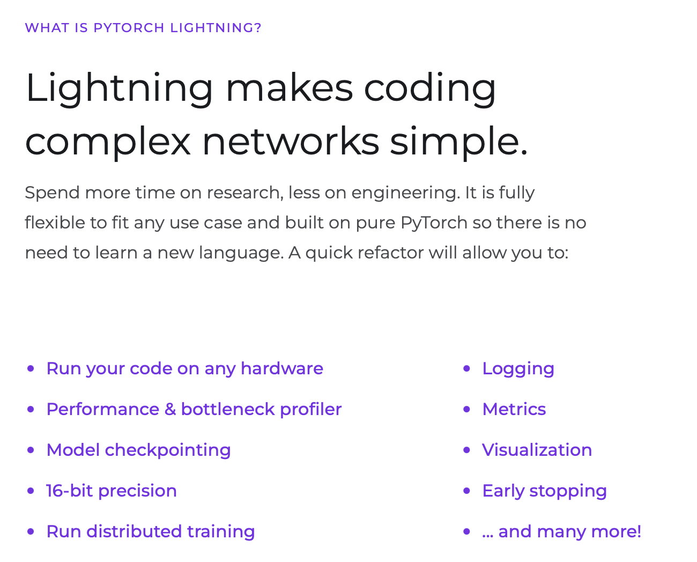

[Pytorch Lightning](https://www.pytorchlightning.ai)

## Why Pytorch Lightning? 🤔

### 💡 There are no .cuda() or .to(device) calls required. Lightning does these for us.
### 💡 Use on TPU extremly easier.

### References -
1. [Basics from PL github examples](https://github.com/Lightning-AI/lightning/tree/master/examples/pl_basics)
2. [Organise Pyorch to PL](https://pytorch-lightning.readthedocs.io/en/stable/starter/converting.html)
3. [Your own data - DataModule](https://pytorch-lightning.readthedocs.io/en/stable/data/datamodule.html)
4. [Hooks](https://pytorch-lightning.readthedocs.io/en/stable/_modules/pytorch_lightning/core/hooks.html)

