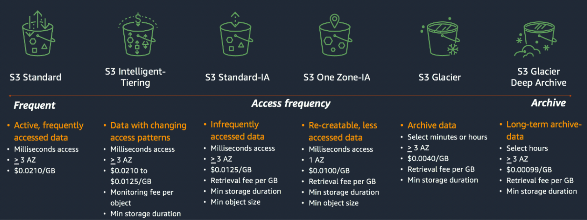
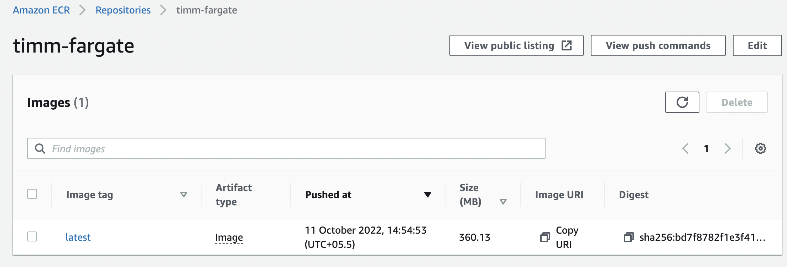

# AWS Regions 
You work in specific region

# AWS EC2  
( Elastic Compute Cloud)

- Amazon EC2 allows you to create virtual machines, or instances, that run on the AWS Cloud
- Different instance types are available as EC2.

Discover more [here](https://aws.amazon.com/ec2/instance-types/)

### General Purpose
- Balance of compute, memory and networking resources
- Ideal for applications that use these resources in equal proportions such as web servers and code repositories. 

### Compute Optimized
- Ideal for compute bound applications that benefit from high performance processors
- Suited for batch processing workloads, media transcoding, high performance web servers, high performance computing (HPC), scientific modeling, dedicated gaming servers and ad server engines, machine learning inference 

### Memory optimized
- Designed to deliver fast performance for workloads that process large data sets in memory.

### Accelerated Computing
- use hardware accelerators, or co-processors, to perform functions, such as floating point number calculations, graphics processing, or data pattern matching, more efficiently than is possible in software running on CPUs.

### Storage Optimized
- For workloads that require high, sequential read and write access to very large data sets on local storage. They are optimized to deliver tens of thousands of low-latency, random I/O operations per second (IOPS) to applications.


## EC2 Pricing
[Pricing](https://aws.amazon.com/ec2/pricing/)

- On demand Pricing (https://aws.amazon.com/ec2/pricing/on-demand/)
- Spot Instance (https://aws.amazon.com/ec2/spot/pricing/)

Price Calculator (https://calculator.aws/)

-----------

# Launching an EC2 instance
*Notes limits usages in limit tier, for getting started only.

1. Go to EC2 Dashboard

2. Click on “Launch Instances”, give a name

3. **AMI** (Amazon Machine Image)

- An AMI is a template that contains the software configuration (operating system, application server, and applications) required to launch your instance. 
- This will be on the disk attached to your EC2

- Select ```Ubuntu 22.04```
- Architecture (default ) - 64-bit(x86)

- Here you can choose the OS type and also the architecture, since there are ec2 instances which are specifically arm based (aws gravitron instances) and if you choose the wrong architecture type then you’ll not be able to use that instance.

- Deeplearning has it’s own special images !

4. Select **Instance Type** ```t2.micro``` 


5. Generate a key pair

- You can use a key pair to securely connect to your instance. Ensure that you have access to the selected key pair before you launch the instance.

**SAVE .pem file SECURELY** 

6. Select Network Settings
- Check Allow SSH Traffic from Anywhere
- To connect from outside, by default allows SSH to system ( will not be able to connect untill they do not have .pem file)
- Click on EDIT and change the name Security Group - name your security group specific to usage

7. Storage Volume : EBS
- Select 20gb, gp2
- Delete on Termination - Yes

NOTE : Terminate the instance , check the region, delete the EBS storage associated if not using

8. Advanced Details 

- allows to request Spot Instances at the Spot price, capped at the On-Demand price
- Check the ```Request spot instance```
- Click on ```Customise``` Set spot instance price a bit higher than spot instance price for that region

- Termination protection : Anyone can terminate 

Here, lets keep as default. No spot instance.

9. Click on Launch Instance

### Connect EC2 instance from local machine

1. Open terminal
2. go to downloads folder (where you have .pem file) and copy to home folder
```
cp testApp.pem ~/
```

NOTE : Use WSL in Windows. Do ```cd ~/``` and start from here (i.e. HOME)

3. Go to instance in AWS web, check for **Public IPv4 address**  and use below
```
ssh -i testApp.pem ubuntu@<yourPublicIPv4Address>
```
Permission would be denied so do again
```
chmod 600 testApp.pem
```
Again
```
ssh -i testApp.pem ubuntu@<yourPublicIPv4Address>
```

😎Now you are using the AWS instance from local machine

#### Instance State

- Stop Instance : EBS volume (storage will be charged), instance billing is stopped
- Terminate Instance : Terminates both instance and EBS
- Hibernate Instance : IP address changes whenever you stop and restart instance. To keep same IP address you can use hibernate but all instance type cannot be hibernated.

#### Connect without specifying .pem file

**NEVER EVER SHARE YOUR** ```~/.ssh/id_rsa file```, it has the private key to your system and then anyone can ssh to your system if they have the private key.

1. Get the public key
```
cat ~/.ssh/id_rsa.pub
```

OR creating public key for our local system or Generating public/private rsa key pair.
```
ssh-keygen
```

2. ssh to EC2 instance to setup once
```
ssh -i testApp.pem ubuntu@<yourPublicIPv4Address>
```

3. Open a file vim ~/.ssh/authorized_keys and paste the key obtained from below command (from your local machine, step - 1 )
```
cat ~/.ssh/id_rsa.pub
```

4. Now you can SSH into your server with simply using
```
ssh ubuntu@<ip_address>
```

#### VSCode Editor

Open VS Code Editor, Ctrl+Shft+P (Windows) or Cmd+Shft+P (Mac) and select ```Connect to current Window to Host```

```Ctrl + ~``` to use terminal inside VSCode Editor

#### TMUX
- To keep sessions running
- To let the code keep running even though we close our VS Code Editor (using tmux window)

1. SSH to EC2 instance using VS Code Editor, use the terminal.

2. Tmux config file [here](https://github.com/gpakosz/.tmux)

To install, run the following from your terminal: (you may want to backup your existing ~/.tmux.conf first)
```
cd
git clone https://github.com/gpakosz/.tmux.git
ln -s -f .tmux/.tmux.conf
cp .tmux/.tmux.conf.local .
```

3. Creating a new tmux session ( here ```work``` is the name given to session)
```
tmux new -s work
```

4. run a program say test.py
```
import time

for i in range(1000):
    print(f'i={i}')
    time.sleep(1)
```

5. To exit without termination the prog ```Ctrl+b``` then d

6. List sessions ```tmux ls```

7. Attach to session ```tmux attach -t work```

8. Detach others and attach ```tmux attach -dt work```

9. Split Windows 
```
Ctrl+b "
Ctrl+b %
```
Mouse Mode
```
Ctrl+b m
```

#### Copy/Snyc to/from local

To copy ```folder``` from local to ec2 instance home ```~/``` (Similar to ```cp``` source to destination)
```
scp -r folder ubuntu@<ip_address>:~/
```

To copy from ec2 instance home ```~/``` to local ```folder``` 
```
scp -r ubuntu@<ip_address>:~/ folder
```

Another way - (shows progress bar and does cache, if copied half way it would resume from that place)
```
rsync -r --info=progress2 folder ubuntu@<ip_address>:~/
```

### AWS S3

- S3 is global (Buckets belong to region)
- Multiple region access

[S3 Pricing](https://aws.amazon.com/s3/pricing/)



#### To change the Storage Tier of an Object

- Select Object(s) → Actions → Edit Storage Class

**NOTE** : Before we can use S3 we need to setup AWS CLI

### AWS CLI

- To interact with AWS services using commands in your command-line shell. 
- Everything that you can do using UI you can do using CLI
- **Remotely Run** commands on Amazon Elastic Compute Cloud (Amazon EC2) instances through a remote terminal program such as PuTTY or SSH, or with AWS Systems Manager.
- All IaaS (infrastructure as a service) AWS administration, management, and access functions in the AWS Management Console are available in the AWS API and AWS CLI.

#### Installation (on EC2 Linux x86(64bit))

[AWS Guide](https://docs.aws.amazon.com/cli/latest/userguide/getting-started-install.html)

```
curl "https://awscli.amazonaws.com/awscli-exe-linux-x86_64.zip" -o "awscliv2.zip"
sudo apt install unzip
unzip awscliv2.zip
sudo ./aws/install
```

Test
```
aws --version
```

- Before we can use AWS CLI we need to **setup AWS IAM**

1. Go to IAM -> Create a policy -> S3 full Access -> NEXT -> Create a role -> Finish

2. Go to EC2 instance -> Actions -> Security -> Modify IAM role -> Attach the role created above -> Done

Now you can transfer files to/from s3.

#### Access S3 bucket/ Objects to/from EC2 instance via CLI

Using AWS CLI with S3
```
aws s3 help
```

List Objects in Bucket
```
aws s3 ls s3://bucket-name/path/
```

Copy Single File 
```
aws s3 cp file.txt s3://bucket-name --storage-class class-name
```

- ```--storage-class```  (string) The type of storage to use for the object. Valid choices are: STANDARD | REDUCED_REDUNDANCY | STANDARD_IA | ONEZONE_IA | INTELLIGENT_TIERING | GLACIER | DEEP_ARCHIVE | GLACIER_IR. Defaults to 'STANDARD'

To copy from local to s3
```
aws s3 cp test.py s3://mlops-tutorials/test/
```

Copy Folder from Local to S3
```
aws s3 cp . s3://bucket-name  --recursive
```

Copy from S3 to Local
```
aws s3 cp s3://bucket-name . --recursive
```

Copy Between Buckets
```
aws s3 cp s3://source-bucket-name/file.txt s3://destination-bucket-name/
```

#### Downloading using Access Point
[Read here](https://aws.amazon.com/s3/features/access-points/)

```
aws s3 cp s3://arn:aws:s3:us-west-2:123456789012:accesspoint/myaccesspoint/mykey mydoc.txt
```

#### S3 Accelerated Endpoint

[Transfer Acceleration, Read here 1](https://docs.aws.amazon.com/AmazonS3/latest/userguide/transfer-acceleration-examples.html)
[Speed Comparison, Read here 2](https://docs.aws.amazon.com/AmazonS3/latest/userguide/transfer-acceleration-speed-comparison.html)


.......WRITE HERE.....Programmatic Access User


### ECS 

Amazon Elastic Container Service is Amazon’s own container orchestration platform. The idea is very similar to Kubernetes.

Irrespective of whichever container orchestration service you are using (ECS or EKS), there are two ways you can implement the underlying infrastructure:

1. Manually manage the cluster and underlying infrastructure such as Virtual Machines / Servers / (also known as EC2 instances).

2. Serverless — Absolutely no need to manage anything. Just upload the container and that’s it. ← **This is AWS Fargate**

### Serverless AWS Fargate

- AWS Fargate is a serverless compute engine for containers that works with both **Amazon Elastic Container Service (ECS) and Amazon Elastic Kubernetes Service (EKS).**

- Fargate makes it easy for you to focus on building your applications. Fargate removes the need to provision and manage servers, lets you specify and pay for resources per application, and improves security through application isolation by design.

[AWS Pricing for Fargate](https://aws.amazon.com/fargate/pricing/)

- With AWS Fargate, you pay for the amount of vCPU and memory resources that your containerized application requests. 

- vCPU and memory resources are calculated from the time your container images are pulled until the Amazon ECS Task terminates, rounded up to the nearest second. A minimum charge of one minute applies.


### Demo App1 using EC2

- On EC2 

1. Install Docker
```
sudo apt update
sudo apt install docker.io
```

2. Check, if gives permission error do next as below
```
docker ps
```

Change permissions( Just Once. log out and login and it should work again). 
Anyone /any grp can read /write execute var/run/docker.sock
```
sudo usermod -aG docker $USER
sudo chmod 777 /var/run/docker.sock
```

3. Copy 3 files - ```vision.py``` , ```requirements.txt```, ```Dockerfile```

3. Build 
```
docker build -t timm-fargate .
```

4. Run
```
docker run -it -p 7860:7860 timm-fargate:latest
```

6. Go and check on public IP and port ```<public IP>:7860``` , This might not be working because we have not made port 7860 public inside **security group** of EC2 instance.

- Go to instance -> security group -> Edit Inboud Rules -> Add rule , say 7860, Anywhere -> Save rules

👯‍♂️ Enjoy Public App 

**Now we need to push docker image to ECR**

## AWS ECR
First we need to push our image to ECR (Elastic Container Registry)

There are two types of Repository, Public and Private

1. Go to AWS ECR, Create a Public repository

- provide the repo name
- select Linux
- Architecture - x86 and x86-64
- Hit 'Create'

2. Go to EC2 instance IAM roles and attach policy  

- EC2 conatiner full accesss
- Elastic conatiner registry Public full Access

3. Click on ```View Push Commands``` on public repo page which you created in step 1
- Run 1st command in CLI to login 
- 2nd command Docker build is already done
- 3rd command ```docker tag timm-fargate:latest public.ecr.aws/o8u9e4v2/timm-fargate:latest``` copy and run
- 4th command ```docker push public.ecr.aws/o8u9e4v2/timm-fargate:latest``` to Push, copy and run



## ECS 

Amazon Elastic Container Service → Create cluster

This will initially create a cluster where we can add containers as deployment. It creates few IAM Roles for itself so takes some time.
- Go to ECS and click create cluster
- Give an name and leave network and other settings as is
- Hit 'Create'

- Your cluster is automatically configured for AWS Fargate (serverless) with two capacity providers. Add Amazon EC2 instances, or external instances using ECS Anywhere.

- If fails, logout login again create. 

Note : Till here there is no services deployed or task running on clusters.

### Create a Task Definition under ECS
- Give name to task e.g. ```TimmInferenceTask```
- Give name to repo, and get URI of repo and paste
- Change / add port e.g. 7860 in our case

- Env variables
- ```Task roles, network mode - conditional``` **for S3 access** etc
- Uncheck logging if you do not wish (it is also charged $)
- Done

Now,

### Deploy

- Go to Cluster which we created, click **deploy**
- Compute configuration -> Capacity provider -> Choose ```Fargate Spot```
- Deployment Configuration -> ```Select Service```
    - Service : Launch a group of tasks handling a long-running computing work that can be stopped and restarted. For example, a web application.
    - Task : Launch a standalone task that runs and terminates. For example, a batch job.
- Specify the Task deifinition name (e.g. TimmInferenceTask) in Family text box with tags
- Specify Service Name, e.g. TimmService
- Security Group : Must select security group defined earlier with port enabled (e.g. testsg with port 7860)
- Public IP is ON
- Load Balancer - not needed here (when you expect huge volume of requests) 
    - Application LB
    - Network Load Balancer
- Hit Deploy, wait for few minutes
- NOTE : Go to Service -> Networking -> Service Role -> Add S3 full access to get access to s3 working in this group
- Got to Cluster-> Tasks (running one) -> click on task id hex -> Get Public IP
- In browser <Public IP>:7860 , you app should run here!!


# Deploy CIFAR10


# General Notes/ Bonus -

- Check Prices (Usually US Oregon region is cheaper )
- Linux command to check disk available : ```df -h``` 
- [Chmod Calculator](https://chmod-calculator.com), a free utility to calculate the numeric (octal) or symbolic value for a set of file or folder permissions in Linux servers.
