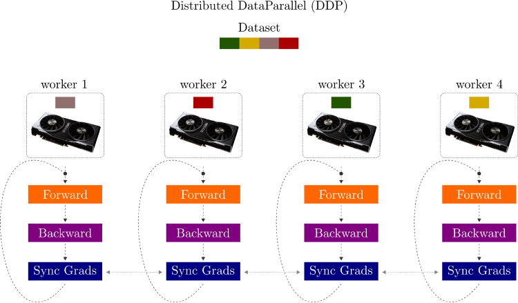

# Distributed Training
Training in multiple GPUs has 2 assets -

- Model
- Data 

Both has to be distrbuted somehow across multiple GPUs. There are 2 ways

1. Data Parallel (DP)
2. Distributed Data Parallel (DDP)

Similar to parallel/distributed computing, multi thread -> Master-Worker

## Multi GPU Training

Pytorch provides two settings for distributed training: 
 - torch.nn.DataParallel (DP) and 
 - torch.nn.parallel.DistributedDataParallel (DDP)
 
 where the latter is officially recommended. In short, DDP is faster, more flexible than DP.


[DataParallel](https://pytorch.org/docs/stable/generated/torch.nn.DataParallel.html#torch.nn.DataParallel)


Shared model

Pytorch implementation. [Read more](https://pytorch.org/docs/stable/nn.html#module-torch.nn.parallel)

DP splits a batch across k GPUs. That is, if you have a batch of 32 and use DP with 2 gpus, each GPU will process 16 samples, after which the root node will aggregate the results.

#### *Weights are averaged and send to all GPUs in order to sync the model. Gradients unctouched at master during model sync.*

```
from torch.nn import DataParallel as DP

wrapped_model = DP(model)
```

[Distributed Data Parallel](https://pytorch.org/tutorials/intermediate/ddp_tutorial.html?highlight=distributed)

#### *The fundamental thing DDP does is to copy the model to multiple gpus, gather the gradients from them, average the gradients to update the model, then synchronize the model over all K processes* GPU 0 only uses optimiser over the gradients!

DP accumulates gradients to the same ```.grad``` field, while DDP first use ```all_reduce``` to calculate the gradient sum across all processes and divide that by ```world_size``` to compute the mean.



- Each GPU across each node gets its own process.
- Each GPU gets visibility into a subset of the overall dataset. It will only ever see that subset.
- Each process inits the model.
- Each process performs a full forward and backward pass in parallel.
- The gradients are synced and averaged across all processes.
- Each process updates its optimizer.
```
from torch.nn.parallel import DistributedDataParallel as DDP

wrapped_model = DDP(model)
```

[Design : How are Gradients applied in backward process?](https://pytorch.org/docs/stable/notes/ddp.html)

*May need to see latest link for designs


## DistributedSampler

https://pytorch.org/docs/stable/data.html#torch.utils.data.distributed.DistributedSampler

Useful ```in conjunction with torch.nn.parallel.DistributedDataParallel```. In such a case, each process can pass a DistributedSampler instance as a DataLoader sampler, and load a subset of the original dataset that is *exclusive to it*.

The ```DistributedSampler``` simply subsamples the data among the whole dataset.

[Code](https://github.com/pytorch/pytorch/blob/master/torch/utils/data/distributed.py#L68)

```
# subsample
indices = indices[self.rank:self.total_size:self.num_replicas]
```

#### with PyTorch Lightning

No code changes, just add the GPU ids you want to train on

```Trainer(gpus=[0, 1])```

https://pytorch-lightning.readthedocs.io/en/1.4.0/advanced/multi_gpu.html

### Logging

Wherever doing ```self.log``` use ```sync_dist=True``` otherwise you will have metric from the master node using a portion of data during multi gpu training.

```
# Add sync_dist=True to sync logging across all GPU workers
self.log('validation_loss', loss, on_step=True, on_epoch=True, sync_dist=True)
```

### Distributed Backends

GLOO and NCCL

- This is primarily used when there’s need for multiple GPUs communication or multi-node multi-gpu communication.

- There are other options like MPI, but NCCL performs far better than it when it comes to GPU Clusters.

- In synchronized data-parallel distributed deep learning, the major computation steps are:

    1. Compute the gradient of the loss function using a minibatch on each GPU.
    2. Compute the mean of the gradients by inter-GPU communication.
    3. Update the model.

NCCL from Nvidia is best as of now!

[More on the All Reduce Algorithm here](https://tech.preferred.jp/en/blog/technologies-behind-distributed-deep-learning-allreduce/)


#### #Workers vrs #GPUs

Workers are based on #CPUs , reads data and creates batch. *Pefer to have 2 workers per GPU.* or N cores then N workers.

GPU compute will be fast and may wait for batch data.


### Request Service Quotas
We may not have access to GPUs Spot instance, then we must request for them (this is once)

1. Go to Service Quotas -> AWS Services 

2. Search for Amazon Elastic Compute Cloud (Amazon EC2) and click on it

3. Select instance types which you need (here I am selecting G&VT type). Click request quota increase and specify the maximum number of vCPUs for all running or requested G and VT Spot Instances per Region. (e.g. I selected 64 - could use 4*16).


### EC2 Spot Instance (How do we know Spot Instance Availability?)

1. Go to EC2 -> (left sidebar) Spot Requests -> Request Spot Instances 

2. Scroll down Instance Type Requirements -> select Manual -> Add Instances if not in list below 


### Launch an EC2 Instance

ssh from local
```
ssh -i <>.pem ubuntu@<Public IP of EC2>
```

From Local get your public keys (use ```ssh-keygen```, if not available)
```
cat ~/.ssh/id_rsa.pub
```

In EC2 instance
```
vim ~/.ssh/authourized_keys
```

#### When wish to copy from one instance to another

1. Copy and paste public keys from small instance to gpu instance to fetch the code
2.  

rsync -r --info=progress2 lightning-hydra-template ubuntu@<Public IP of GPU>:~/


### Run in 1 GPU instance 
e.g. ```g4dn.xlarge```

1. Launch the instance 

2. List the environments available and go to pytorch one

```
conda env list
source activate pytorch
```
3. Git clone the repo
```
git clone https://github.com/aiplaybookin/lightning-hydra-template.git
```

4. Change the config->experiment->cifar.yaml : ```- override /trainer: gpu.yaml```

5. Change the config->datamodule->cifar10.yaml : ```num_workers: 4```


Run nvidia smi every 0.5 sec ```watch -n 0.5 nvidia-smi``` 

Kill a previous orphan process, go check
```ps -ef | grep python``` and ```nvidia-smi``` later 

```kill -9 <PID>```


Ray : 
Create instance , yaml file for aws for instances. setup iam roles, copy code , 

slurm 

