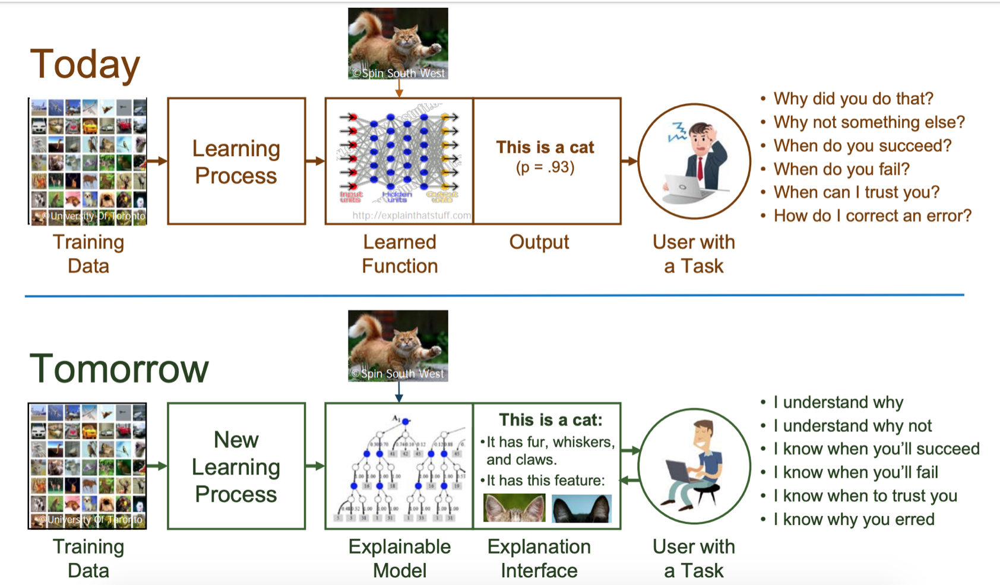
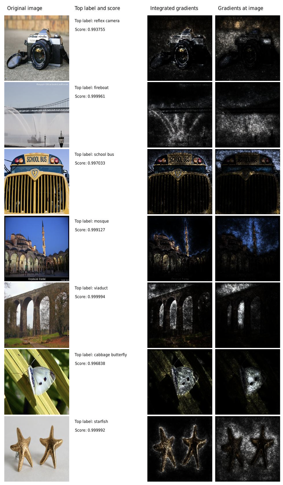
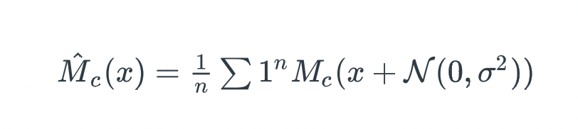
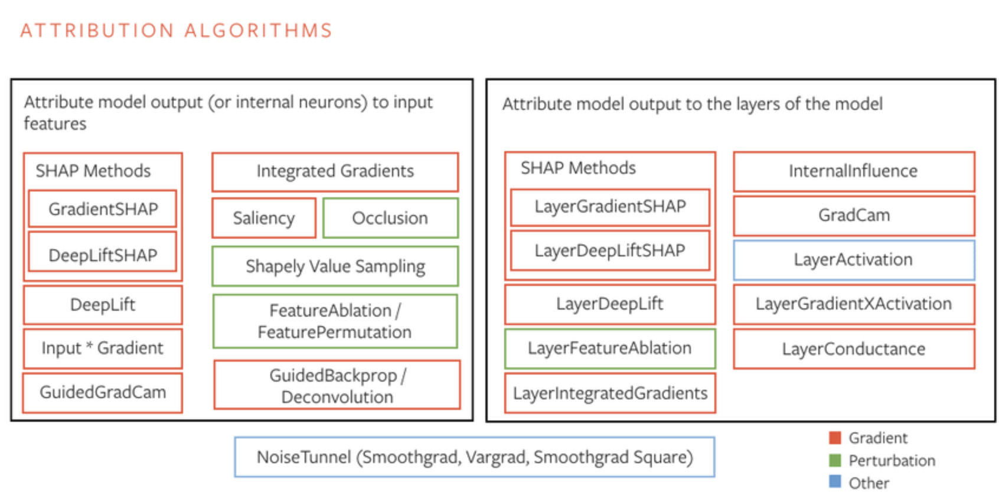
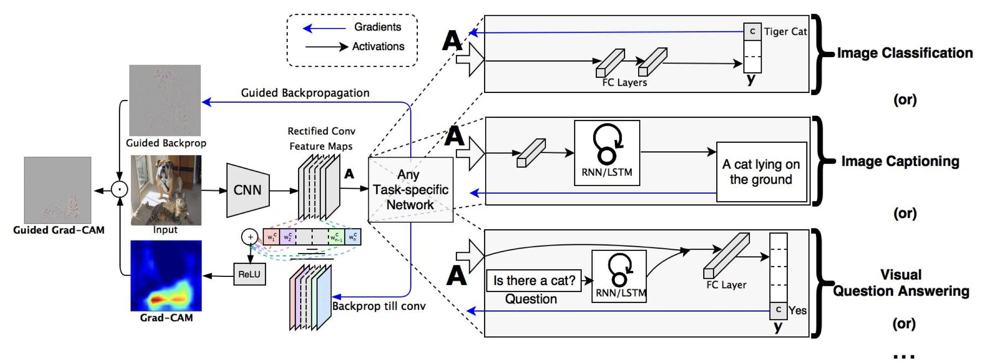
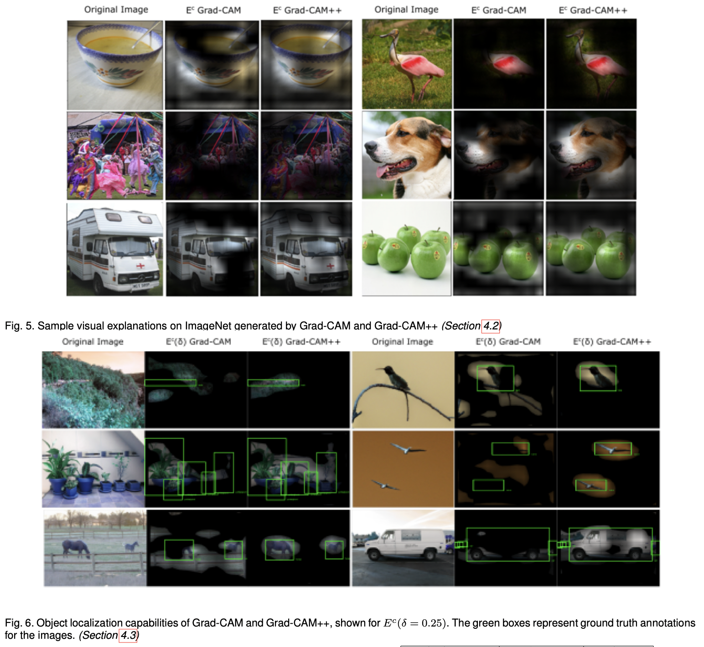

<table align="center"><tr><td align="center" width="9999">


# Model Explainability

Survey of different ways of model explainability in Computer Vision
</td></tr></table>


## Integrated Gradients

Intro Paper: *Axiomatic Attribution for Deep Networks* [Read here](https://arxiv.org/abs/1703.01365)

The original definition of Integrated Gradients is incalculable (because of the integral). Therefore, the implementation of the method uses approximated value by replacing the integral with the summation

The problem of attributing the prediction of a deep network to its input features (or Explainability)

- Applied to Image, NLP and Chemistry Models

**Steps for calculating Integrated Gradients**

1. Start from the baseline where baseline can be a black image whose pixel values are all zero or an all-white image, or a random image. Baseline input is one where the prediction is neutral and is central to any explanation method and visualizing pixel feature importances.

2. Generate a linear interpolation between the baseline and the original image. Interpolated images are small steps(α) in the feature space between your baseline and input image and consistently increases with each interpolated image’s intensity.

3. Calculate gradients to measure the relationship between changes to a feature and changes in the model’s predictions.

The gradient informs which pixel has the strongest effect on the models predicted class probabilities.

Varying variable changes the output, and the variable will receive some attribution to help calculate the feature importances for the input image. A variable that does not affect the output gets no attribution.

4. Compute the numerical approximation through averaging gradients

5. Scale IG to the input image to ensure that the attribution values are accumulated across multiple interpolated images are all in the same units. Represent the IG on the input image with the pixel importances.

My results :

<Place your own IG Image example here>

Results from Paper :



More on Integrated Gradients -[here](https://erdem.pl/2022/04/xai-methods-integrated-gradients)

## Noise Tunnel

Noise Tunnel is **not an attribution method** but a technique that improves the accuracy of attribution methods.

SmoothGrad calculates the attribution ```Mc``` using any available method by providing that method an input with Gaussian noise. It then calculates a mean value from all the samples to reduce the importance of less frequent attributions. The idea is that when adding noise to the input image, important attributions are going to be visible most of the time, and noise might change between attributions.



<Place your own Image example here> 5 sub plot images

# Attribution Algorithms in Captum



An overview of all the attribution algorithms in Captum. The algorithms grouped on the left side of the diagram are the ```primary and neuron attribution``` algorithms. The ones on the right side of the diagram are ```layer attribution``` variants.

## Gradient SHAP

GradientShap approximates SHAP values by computing the expectations of gradients by randomly sampling from the distribution of baselines/references. It adds white noise to each input sample n_samples times, selects a random baseline from baselines’ distribution and a random point along the path between the baseline and the input, and computes the gradient of outputs with respect to those selected random points. The final SHAP values represent the expected values of gradients * (inputs - baselines).

In some sense it can be viewed as an approximation of integrated gradients by computing the expectations of gradients for different baselines.

## Occlusion

A perturbation based approach to compute attribution, involving replacing each contiguous rectangular region with a given baseline / reference, and computing the difference in output. For features located in multiple regions (hyperrectangles), the corresponding output differences are averaged to compute the attribution for that feature.

The first patch is applied with the corner aligned with all indices 0, and strides are applied until the entire dimension range is covered. Note that this may cause the final patch applied in a direction to be cut-off and thus smaller than the target occlusion shape.

Read more [here](https://arxiv.org/abs/1311.2901)

## SHAP (SHAPley Additive exPlanations)

SHAP (Shapley Additive Explanations) by Lundberg and Lee [2016](https://dl.acm.org/doi/10.5555/3295222.3295230) is a method to explain individual predictions, based on the game theoretically optimal Shapley values. Shapley values are a widely used approach from cooperative game theory that come with desirable properties. The feature values of a data instance act as players in a coalition. The Shapley value is the average marginal contribution of a feature value across all possible coalitions

<Place an example image here  >

Red areas increase the probability of that class, and blue areas decrease the probability.

Read more [here](https://proceedings.neurips.cc/paper/2017/file/8a20a8621978632d76c43dfd28b67767-Paper.pdf)

## Saliency

Simple approach that returns the gradients of the output with respect to the input

<Place here example>

The procedure is related to the ConvNet training procedure, where the back-propagation is used to optimise the layer weights. The difference is that in our case the optimisation is performed with respect to the input image, while the weights are fixed to those found during the training stage. But here the input image is started with empty and the image itself is optimised. The class model visualization for several classes is below.

## Grad CAM

Read more [here](https://arxiv.org/pdf/1610.02391.pdf)

## Grad CAM ++

Explanation and Derivation of GradCAM++ [here](https://sites.math.northwestern.edu/~mlerma/papers/Grad_CAM___is_equivalent_to_Grad_CAM_with_positive_gradients.pdf)

Original Paper [here](https://arxiv.org/pdf/1710.11063.pdf)



# Adversarial Attacks

Adversarial machine learning is a machine learning method that aims to trick machine learning models by providing deceptive input. Hence, it includes both the generation and detection of adversarial examples, which are inputs specially created to deceive classifiers.

### PLace an image here

## Perceptual hash function

Perceptual hash functions are widely used in finding cases of online copyright infringement as well as in digital forensics because of the ability to have a correlation between hashes so similar data can be found (for instance with a differing watermark).

[more here](https://en.wikipedia.org/wiki/Perceptual_hashing)

## NeuralHash

https://github.com/anishathalye/neural-hash-collider

NeuralHash is a perceptual hash function that uses a neural network. Images are resized to 360x360 and passed through a neural network to produce a 128-dimensional feature vector. Then, the vector is projected onto R^96 using a 128x96 "seed" matrix. Finally, to produce a 96-bit hash, the 96-dimensional vector is thresholded: negative entries turn into a ```0``` bit, and non-negative entries turn into a ```1``` bit.

This entire process, except for the thresholding, is differentiable, so we can use gradient descent to find hash collisions. This is a well-known property of neural networks, that they are vulnerable to [adversial examples](https://arxiv.org/abs/1312.6199)

#### Place image here

The first image above is the original Picard image. The second was produced to collide with Sidious. The third was produced with the additional argument ```--blur 0.5```. The fourth is the original Sidious image.

https://greentfrapp.github.io/compute-your-own-neuralhash/

More on Apple’s paper: https://www.apple.com/child-safety/pdf/CSAM_Detection_Technical_Summary.pdf

You can check on Macbook 
```
ls /System/Library/Frameworks/Vision.framework/Resources/ | grep -i hash
```

# FGSM (Fast Gradient Sign Method)

Fast Gradient Sign Method is a ```one-step method``` that can generate adversarial examples.

For non-targeted attack, the formulation is:
```
x' = x + epsilon * sign(gradient of L(theta, x, y))
```

For targeted attack on t, the formulation is:
```
x' = x - epsilon * sign(gradient of L(theta, x, t))
```

where, ```L(theta, x, y)``` is the model’s loss function with respect to model parameters, inputs and labels.

Steps :
1. Taking an input image
2. Making predictions on the image using a trained CNN
3. Computing the loss of the prediction based on the true class label
4. Calculating the gradients of the loss with respect to the input image
5. Computing the sign of the gradient
6. Using the signed gradient to construct the output adversarial image

Red more [here](https://arxiv.org/abs/1412.6572)

# PGD (Projected Gradient Descent)

Projected Gradient Descent is an ```iterative version of the one-step attack FGSM``` that can generate adversarial examples. It takes multiple gradient steps to search for an adversarial perturbation within the desired neighbor ball around the original inputs. In a non-targeted attack, the formulation is:

```
x_0 = x x_(t+1) = Clip_r(x_t + alpha * sign(gradient of L(theta, x, t)))
```

where, 
- ```Clip``` denotes the function that projects its argument to the r-neighbor ball around x so that the perturbation will be bounded. 
- ```Alpha``` is the step size. 
- ```L(theta, x, y)``` is the model’s loss function with respect to model parameters, inputs and targets. 

In a targeted attack, the formulation is similar:
```
x_0 = x x_(t+1) = Clip_r(x_t - alpha * sign(gradient of L(theta, x, t)))
```

Read more [here](https://arxiv.org/abs/1706.06083)

