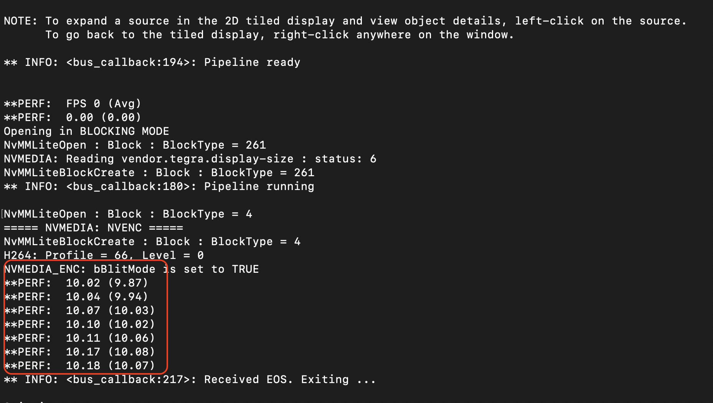
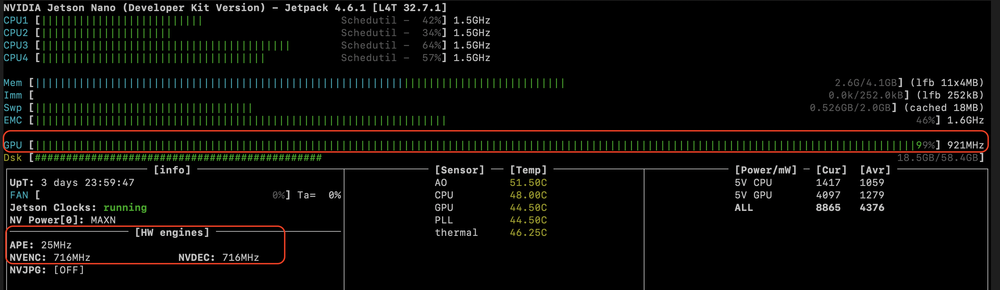

## Results 

***Video***

[Yolo-tiny on Jetson nano](https://youtu.be/GPZsdEFRfq8)

[Yolo on Jetson nano](https://youtu.be/0j0eQue9olc)

***FPS***




### DeepStream

Hands-on Deepstream now ! 🔥

- Application that shipwith Deepstream
```cd /opt/nvidia/deepstream/deepstream-6.0/bin```

- Libraries, tensorflow ones...deepStream also has
```cd /opt/nvidia/deepstream/deepstream-6.0/lib```

- Plugins build  - infer, tracker, msgbroker, multistream, audiio transformers .... shared object files (.so)
```cd /opt/nvidia/deepstream/deepstream-6.0/gst-plugins```

- Apps
```cd /opt/nvidia/deepstream/deepstream-6.0/samples/configs/deepstream-app```

DeepStream has its own way of maing pipeline

We will create a pipeline - ```test-deepstream.txt```

```
vim test-deepstream.txt
```

vi config_infer_primary_yoloV7_vk.txt
```
custom-network-config=/home/nanodev/bpl/DeepStream-Yolo/yolov7-tiny.cfg
model-file=/home/nanodev/bpl/DeepStream-Yolo/yolov7-tiny.wts
```

vi config_infer_primary_yoloV7_vk.txt
```
custom-network-config=/home/nanodev/bpl/yolov7.cfg
model-file=/home/nanodev/bpl/yolov7.wts
```

vi deepstream_app_config.txt 
```
[sink1]
output-file=yolov7-out.mp4

[primary-gie]
config-file=config_infer_primary_yoloV7_vk.txt
```

source :
sink : where to place the output - display or write to file 

primary-gie : specify the model engine file
- interval : skip frames


#### Run
```export DISPLAY=:0```

```deepstream-app -c deepstream_app_config.txt```

Add a sink to dump the annotated outputs

### To generate configs & weights to be used on Edge device for inference
1. Spin off a EC2 GPU instance 
2. git clone https://github.com/WongKinYiu/yolov7.git
3. git clone https://github.com/marcoslucianops/DeepStream-Yolo.git
4. cd yolov7 and copy the file ```cp ~/DeepStream-Yolo/utils/gen_wts_yoloV7.py .```
5. wget https://github.com/WongKinYiu/yolov7/releases/download/v0.1/yolov7.pt
6. pip install -r requirements.txt ( might have to do sudo apt update and sudo apt install python3-pip)
7. python gen_wts_yoloV7.py -w yolov7.pt

#### 
From Local, copy config and weights to local
```scp -i <>.pem ubuntu@54.153.149.155:~/yolov7/yolov7.cfg Downloads/yolov7.cfg```

To copy configs to edge device
```scp -P 7022  Downloads/yolov7.cfg nanodev@emlo.theschoolof.ai:/home/nanodev/bpl/DeepStream-Yolo/yolov7.cfg```

To copy weights to edge device
```scp -P 7022  Downloads/yolov7.wts nanodev@emlo.theschoolof.ai:/home/nanodev/bpl/DeepStream-Yolo/yolov7.wts```

To download yolo outputs
```scp -P 7022  nanodev@emlo.theschoolof.ai:/home/nanodev/bpl/DeepStream-Yolo/yolov7-out.mp4 Downloads/yolov7-out.mp4```

To download yolo-tiny outputs
```scp -P 7022  nanodev@emlo.theschoolof.ai:/home/nanodev/bpl/DeepStream-Yolo/tiny-out.mp4 Downloads/tiny-out.mp4```


```
[property]
gpu-id=0
net-scale-factor=0.0039215697906911373
model-color-format=0
custom-network-config=/bpl/DeepStream-Yolo/yolov7-tiny.cfg
model-file=/bpl/DeepStream-Yolo/yolov7-tiny.wts
model-engine-file=model_b1_gpu0_fp32.engine
#int8-calib-file=calib.table
labelfile-path=labels.txt
batch-size=1
network-mode=0
num-detected-classes=80
interval=0
gie-unique-id=1
process-mode=1
network-type=0
cluster-mode=2
maintain-aspect-ratio=1
parse-bbox-func-name=NvDsInferParseYolo
custom-lib-path=nvdsinfer_custom_impl_Yolo/libnvdsinfer_custom_impl_Yolo.so
engine-create-func-name=NvDsInferYoloCudaEngineGet

[class-attrs-all]
nms-iou-threshold=0.45
pre-cluster-threshold=0.25
topk=300
```

## Devices  
- For first timers can start with ```NVIDIA Jetson Nano 2GB Developer Kit```
- Rasberry Pi 4 etc (for IoT usage mostly)
- Atleast 64gb memory card or m.2 (in xavier nx) ssd based on varient

Pytorch Mobile - Android and iOS ( iOS recent dev picked up)

## Others :

- Avoid Docker for edge devices - Jetson(Vision related), Rasberry pi (IoT related) - ***every cycle matters!*** 

- Every thing needs to be in compiled language.

- Latest ones are ```ARM architecture``` (Jetson, Rasberry pi)

- ```Tensorflow Lite``` : Most squeezed and light models 

- GPU accelerated TensorFlow Lite / TensorRT applications :  https://github.com/terryky/tflite_gles_app

- .so file : shared object

- C/C++ is must

- ```htop``` or ```jtop```

- NVENC : write videos

- NVDEC : read videos

- NVJPG : 