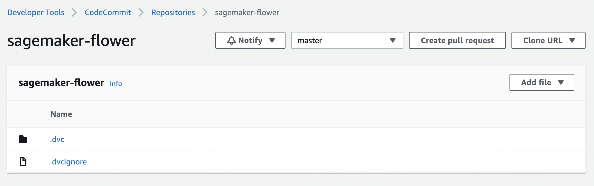
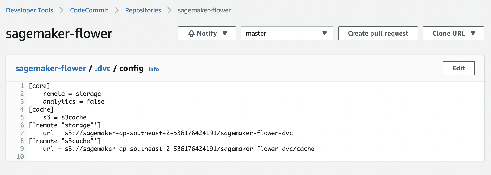

Create ```Custom Docker Image``` for all Sagemaker Jobs

- how to package a PyTorch container, extending the SageMaker PyTorch container by extending the SageMaker PyTorch container we can utilize the existing training and hosting solution made to work on SageMaker.

- AWS DLC (Deep Learning Containers), choose one of these as base https://github.com/aws/deep-learning-containers/blob/master/available_images.md 

e.g. ```763104351884.dkr.ecr.us-east-1.amazonaws.com/pytorch-training:1.12.1-cpu-py38-ubuntu20.04-sagemaker```

Spin up a EC2 instance 
Create a requirements.txt with required packages and versions
Create a dockerfile file with below contents
Create a repo in ECR, copy build commands

From EC2 terminal LOGIN : ()
```aws ecr get-login-password --region ap-southeast-2 | docker login --username AWS --password-stdin 763104351884.dkr.ecr.ap-southeast-2.amazonaws.com```


Then Build DOCKER ```docker build -t custom-pytorch-cpu-sagemaker .```

After the build is completed, tag your image so you can push the image to this repository:
```docker tag custom-pytorch-cpu-sagemaker:latest 536176424191.dkr.ecr.ap-southeast-2.amazonaws.com/custom-pytorch-cpu-sagemaker:latest```


Then again login to ```aws ecr get-login-password --region ap-southeast-2 | docker login --username AWS --password-stdin 536176424191.dkr.ecr.ap-southeast-2.amazonaws.com```

Run the following command to push this image to your newly created AWS repository:
```docker push 536176424191.dkr.ecr.ap-southeast-2.amazonaws.com/custom-pytorch-cpu-sagemaker:latest```


Refer [Building AWS Deep Learning Containers Custom Images](https://docs.aws.amazon.com/deep-learning-containers/latest/devguide/deep-learning-containers-custom-images.html)

## Steps to preprocess and Train
1. Upload data file in .zip (data source https://www.kaggle.com/datasets/puneet6060/intel-image-classification) to S3.
```s3://mlops-tutorials/sagemaker-mlops1/intel/```

2. Create a repo in AWS CodeCommit for DVC

3. Run setup notebook

4. Run Preprocessing notebook

5. Run Train notebook


### Why should I extend a SageMaker container?
- Install additional dependencies. (E.g. I want to install a specific Python library, that the current SageMaker containers don't install.)
- Configure your environment. (E.g. I want to add an environment variable to my container.)

### Permissions
```SageMakerFullAccess``` and ```AmazonEC2ContainerRegistryFullAccess``` to create the custom docker

### 1. Setup Git and DVC
1. First download the dataset [click here](https://www.kaggle.com/datasets/alxmamaev/flowers-recognition?resource=download)
and upload to S3.

2. AWS Codecommit, create a repository named ```sagemaker-flower``` . Clone via HTTPS and use in setup notebook.

3. Setup DVC and provide path to s3 folder for data version storage

Notebook link : 




4. 


# References : 
1. https://docs.aws.amazon.com/sagemaker/latest/dg/build-your-own-processing-container.html

2. https://github.com/aws/amazon-sagemaker-examples/blob/main/advanced_functionality/pytorch_extending_our_containers/pytorch_extending_our_containers.ipynb

3. AWS DLC (Deep Learning Containers), choose one of these as base https://github.com/aws/deep-learning-containers/blob/master/available_images.md

4. Custome Docker Image https://docs.aws.amazon.com/deep-learning-containers/latest/devguide/deep-learning-containers-custom-images.html

5. Setup for HTTPS users using Git credentials 
https://docs.aws.amazon.com/codecommit/latest/userguide/setting-up-gc.html?icmpid=docs_acc_console_connect_np